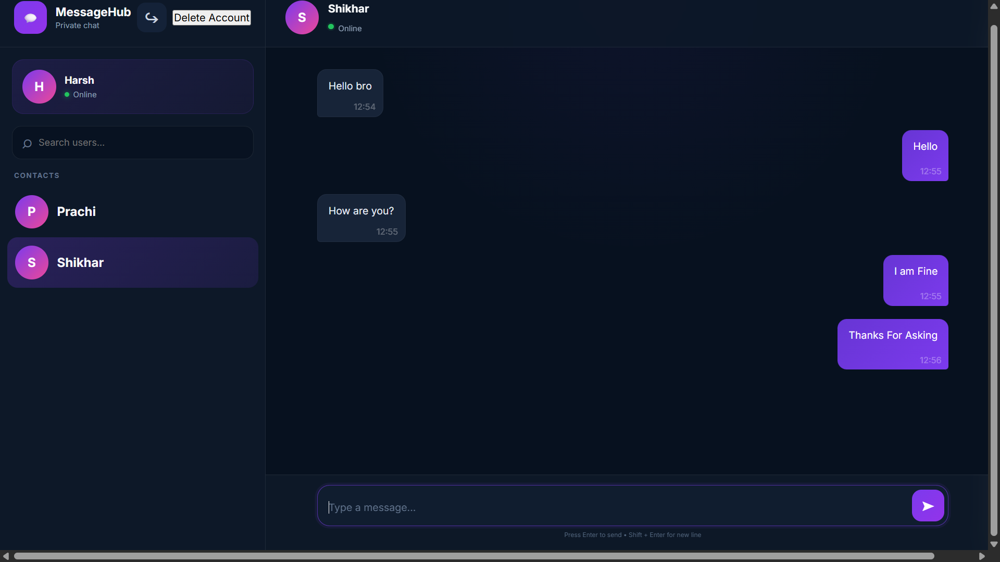

# 💬 MessageHub

### 🚀 Modern Private Messaging Web Application

MessageHub is a clean and modern private messaging application built with **Node.js, Express, MySQL, HTML, CSS, and JavaScript**.

<p align="center">
  
</p>

<p align="center">
  🔐 Secure Authentication &nbsp; • &nbsp;
  💬 Private Chat &nbsp; • &nbsp;
  🟢 Online Status
</p>

---

## 📸 Screenshots

### 🔐 Login Page

<p align="center">
  
</p>

### 💬 Chat Page

<p align="center">
  
</p>

---

## ✨ Features

- 🔐 Login & Registration
- 💬 Private one-to-one messaging
- 🟢 Online/Offline status
- 🔎 User search
- ⚡ Automatic message updates
- 🗑️ Delete messages
- 👤 Delete account
- 🔒 JWT authentication
- 🔑 Bcrypt password security
- 📱 Responsive UI

---

## 🛠️ Tech Stack

**Frontend:** HTML • CSS • JavaScript

**Backend:** Node.js • Express.js

**Database:** MySQL

**Security:** JWT • Bcrypt

---

## ⚙️ Installation

```bash
npm install
node server.js